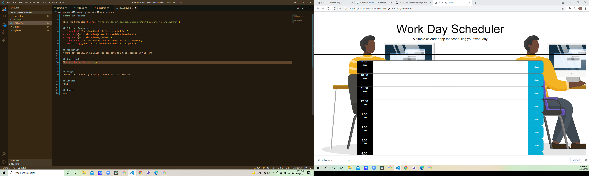

# Work Day Planner

[Link to Scheduler](<a href="C:\Users\Jacq\Activities\Homework\WorkDayPlannerHW\index.html">)

## Table of Contents
- [index.html](Contains-the-html-for-the-scheduler.)
- [script.js](Contains-the-javascript-used-in-the-scheduler.)
- [style.css](Contains-the-stylesheet.)
- [screenshot](Contains-the-screenshot-image-of-the-scheduler.)
- [office.jpeg](Contains-the-backround-image-on-the-page.)

## Desciption
A work day scheduler in which you can save the text entered in the form.

## Screenshots

## Usage
Use this scheduler by opening index.html in a browser.

## License
None

## Badges
None